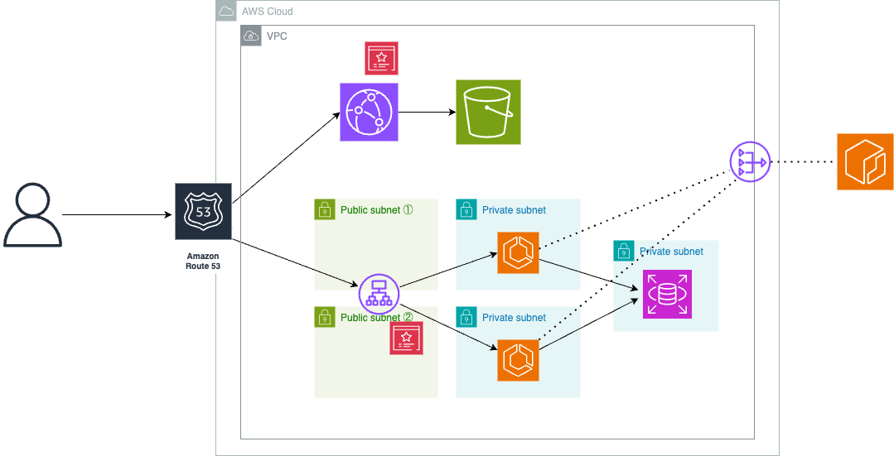

## Infra Architecture


## Directory Structure
```
terraform-ecs/
├── environments/
│   └── dev/
│       ├── backend.tf
│       ├── main.tf
│       └── variables.tf
├── modules/
│    ├── acm/
│    ├── alb/
│    ├── cloudfront/
│    ├── ecr/
│    ├── ecs_cluster/
│    ├── ecs_service/
│    ├── ecs_task_definition/
│    ├── internet_gateway/
│    ├── nat_gateway/
│    ├── rds/
│    ├── route53/
│    ├── route_table/
│    ├── s3/
│    ├── secrets_manager/
│    ├── security_group/
│    ├── subnet/
│    └── vpc/
├── .gitignore
├── README.md
├── infra.dio
└── infra.png
```